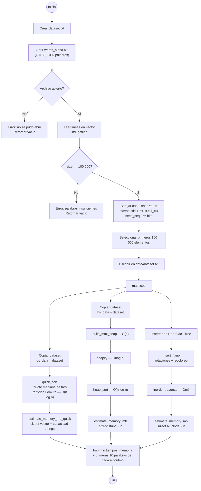

# Diagrama de flujo — Práctica 1 EDA

```mermaid
flowchart TD
    A((Inicio)) --> B["Crear dataset.txt"]

    B --> C["Abrir words_alpha.txt\n(UTF-8, 100k palabras)"]
    C --> C1{Archivo abierto?}
    C1 -- No --> ERR1["Error: no se pudo abrir\nRetornar vacío"]
    C1 -- Sí --> D["Leer líneas en vector\nstd::getline"]

    D --> VAL{"size >= 100 000?"}
    VAL -- No --> ERR2["Error: palabras insuficientes\nRetornar vacío"]
    VAL -- Sí --> E["Barajar con Fisher-Yates\nstd::shuffle + mt19937_64\nseed_seq 256 bits"]

    E --> F["Seleccionar primeros 100 000 elementos"]
    F --> G["Escribir en data/dataset.txt"]
    G --> MAIN["main.cpp"]

    MAIN --> QS_COPY["Copiar dataset\nqs_data = dataset"]
    MAIN --> HS_COPY["Copiar dataset\nhs_data = dataset"]
    MAIN --> RBT_INS["Insertar en Red-Black Tree"]

    QS_COPY --> QS["quick_sort\nPivote mediana de tres\nPartición Lomuto — O(n log n)"]
    QS --> QS_MEM["estimate_memory_mb_quick\nsizeof vector + capacidad strings"]

    HS_COPY --> HS_BUILD["build_max_heap — O(n)"]
    HS_BUILD --> HS_HEAPIFY["heapify — O(log n)"]
    HS_HEAPIFY --> HS_SORT["heap_sort — O(n log n)"]
    HS_SORT --> HS_MEM["estimate_memory_mb\nsizeof string × n"]

    RBT_INS --> RBT_FIX["insert_fixup\nrotaciones y recoloreo"]
    RBT_FIX --> RBT_IN["inorder traversal — O(n)"]
    RBT_IN --> RBT_MEM["estimate_memory_mb\nsizeof RBNode × n"]

    QS_MEM --> RES["Imprimir tiempos, memoria\ny primeras 10 palabras de cada algoritmo"]
    HS_MEM --> RES
    RBT_MEM --> RES

    RES --> Z((Fin))
```
